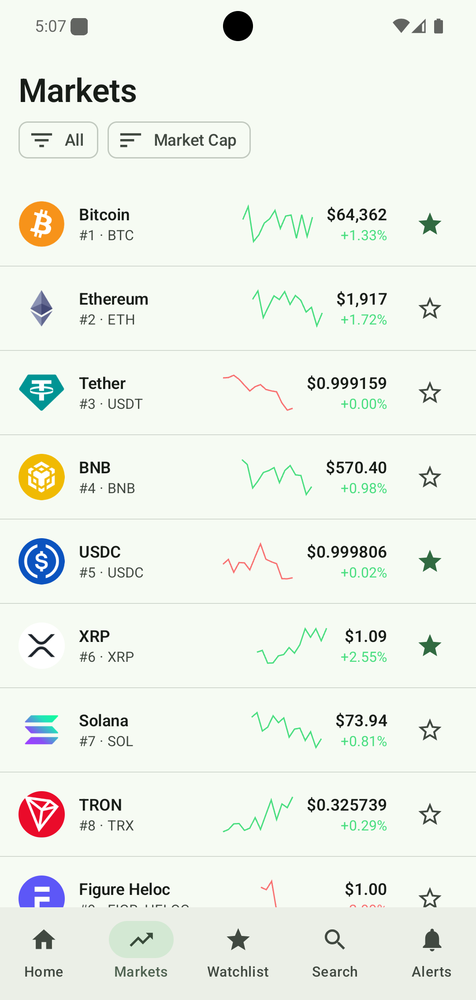
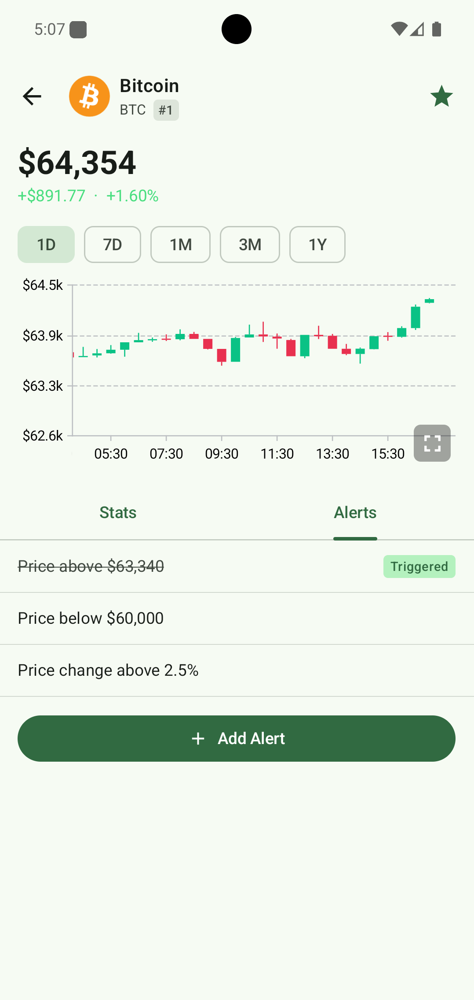
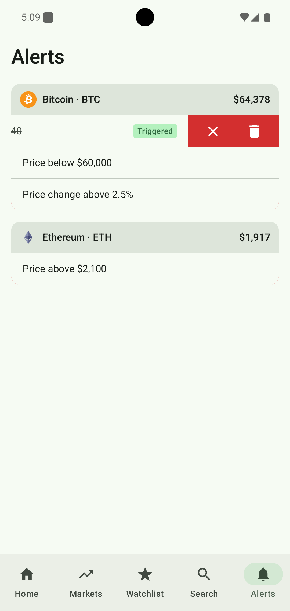

# Vela

Vela is a native Android crypto tracking app built with Kotlin and Jetpack Compose. It lets you browse coin markets, search and watch coins, view detailed price charts, and set price/percentage alerts
that trigger as background notifications — even when the app is closed.

Data is powered by the [CoinGecko API](https://www.coingecko.com/en/api).

## Screenshots

<p align="center">
  
  
  
</p>

## Features

- **Home** — top coins ranked by market cap, with pull-to-refresh, live price updates, sparklines, and quick watchlist actions.
- **Markets** — paginated list of coins sorted by market cap or volume, filterable by category, with 7-day price sparklines.
- **Search** — instant coin search with empty/no-results states.
- **Watchlist** — star any coin from any screen to track it; persisted locally with Room.
- **Coin detail** — OHLC candlestick charts (via [Vico](https://github.com/patrykandpatrick/vico)) across multiple time ranges, full-screen landscape chart mode, market stats (market cap, volume,
  circulating supply, ATH/ATL), and shared-element transitions from list to detail.
- **Alerts** — create price-target or percentage-change alerts per coin, with validation, background polling via WorkManager, local notifications on trigger, and deep links from the notification
  straight back to the relevant coin/alert.
- **Error handling** — dedicated loading, empty, no-results, offline, and server-error states, with retry actions and non-blocking error banners where content can remain visible.

## Architecture

Vela follows a **Clean Architecture** approach with unidirectional data flow (MVVM + `StateFlow`), split into three layers:

```
ui/       Compose screens, ViewModels, navigation, shared UI components
domain/   Use cases, repository interfaces, domain models — no Android/framework dependencies
data/     Repository implementations, Room database, Retrofit API, background workers
```

Key patterns:

- **Dependency injection** with Hilt across app, ViewModel, and WorkManager (`HiltWorker`) scopes.
- **Use-case-driven domain layer** — each user action (e.g. `ToggleWatchlistUseCase`, `EditAlertUseCase`, `RunAlertChecksUseCase`) is an isolated, independently testable class.
- **Reactive data layer** — Room DAOs and repositories expose `Flow`, combined with an in-memory `SimplePriceStore` for live price updates across screens without re-fetching.
- **Background alert engine** — `AlertCheckWorker` (WorkManager) periodically checks live prices against active alerts and fires local notifications; `AlertCheckScheduler` abstracts scheduling so it's
  swappable/testable independent of WorkManager.
- **Paging 3** for the markets list, **Coil** for image loading, **Navigation Compose** with deep-link support for jumping from a notification to a specific coin/alert.

## Tech stack

| Layer   | Libraries                                                            |
|---------|----------------------------------------------------------------------|
| UI      | Jetpack Compose, Material 3, Navigation Compose, Vico (charts), Coil |
| DI      | Hilt                                                                 |
| Data    | Retrofit, Moshi, Room, Paging 3, shared in-memory price store        |
| Async   | Kotlin Coroutines & Flow, WorkManager                                |
| Testing | JUnit, MockK, Turbine, Robolectric, Compose UI Test, Espresso        |
| Tooling | Ktlint (with a custom rule module), GitHub Actions CI                |

## Testing

The project has strong test coverage across all layers:

- **40 unit test classes — 399 test cases** — use cases, repositories, mappers, ViewModels, and the alert-checking/polling logic.
- **13 instrumented test classes — 104 test cases** — Compose screen tests, navigation/deep-link E2E tests, and Room DAO tests, using Hilt test modules with fake repositories for isolation.

Run tests locally:

```bash
./gradlew test                        # unit tests
./gradlew connectedDebugAndroidTest    # instrumented tests (device/emulator required)
./gradlew ktlintCheck                  # lint/style check
```

## CI

GitHub Actions runs unit tests, instrumented tests (on an emulated Pixel 7, API 35), and Ktlint checks on every pull request into `dev`.

## Getting started

1. Clone the repo and open it in Android Studio (Panda 4 or newer recommended).
2. Sync Gradle — the project uses the Kotlin DSL and version catalogs (`gradle/libs.versions.toml`).
3. Run the `app` configuration on a device or emulator (minSdk 26).

> **Note:** the app currently authenticates to the CoinGecko demo API with a key hardcoded in `NetworkModule.kt`. Before making this repository public, move it out of source (e.g. into
`local.properties` + `BuildConfig`, git-ignored) and rotate the key.

## Project structure

```
app/src/main/java/com/vela/
├── data/           # Repositories, Room, Retrofit, background workers, DI modules
├── domain/         # Use cases, repository interfaces, domain models
└── ui/
    ├── navigation/ # NavGraph, deep links
    ├── screens/    # home, markets, search, watchlist, detail, alerts
    └── common/     # shared Compose components, charts, utilities
```
